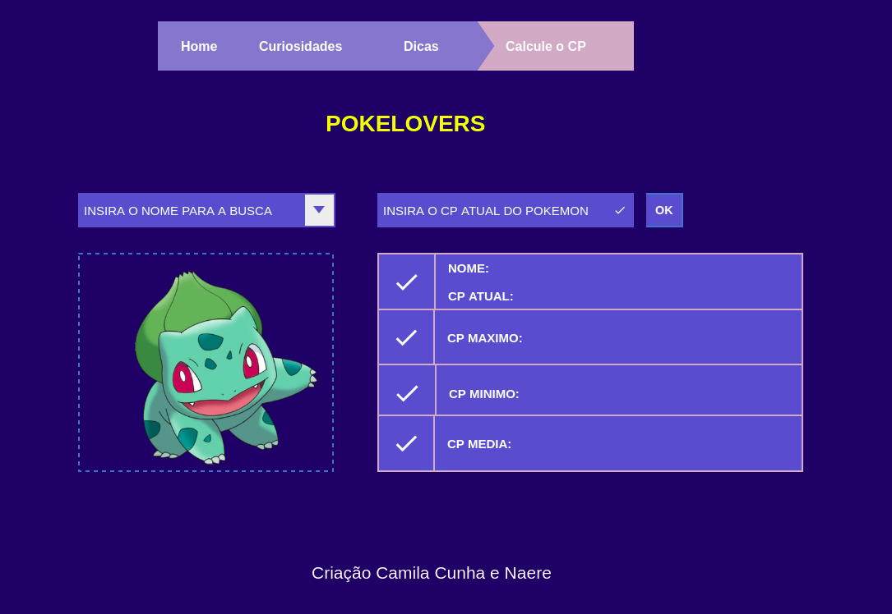

# 

#### Para acessar a página [clique aqui](https://camilagerarde.github.io/SAP004-data-lovers/). :computer:

[Introdução](#introdução) | [Criação e desenvolvimento](#criação-e-desenvolvimento) | [Sobre a página](#sobre-a-página) | [Considerações técnicas](#considerações-técnicas) | [Instalação e execução](#instalação-e-execução-octocat) | [Agradecimentos](#agradecimentos)

---

## Introdução
O projeto **Pokelovers**, se trata de uma página WEB com visualização de um conjunto de dados, que se adequa a necessidade do usuário. 
Nela é possível ao usuário, pesquisar dados, filtrá-los, ordená-los e fazer algum calculo agregado.

> Cálculo agregado se refere aos diversos cálculos que podem ser feitos com os dados para mostrar a informação mais relevante para os usuários (médias, valores máximos e mínimos, etc).

Utilizamos o banco de dados do anime **Pokémon**.

<p align="center">
 
</p>

## Criação e desenvolvimento

### Identificação do usuário:
Como início da nossa definição de usuário criamos personas, que representam nossos possíveis usuários e suas necessidades, para assim compreender e planejar as soluções que deveríamos oferecer em nossa aplicação.

<p align="center">

</p>

Também fizemos uma pesquisa de preferências pelo [Google Forms](https://www.google.com/forms/about/), para a definição dos dados e informações disponíveis ao usuário de acordo com suas reais necessidades.

### Identificação de Histórias de Usuário:

Com estes dados então definimos nossas Histórias de usuário e o protótipo para o nosso projeto:

**História de usuário 01**  
> Eu como usuário, quero acessar a aplicação "POKELOVERS" e visualizar todos os pokemons de Kanto e suas informações básicas coletadas na pesquisa de preferências.

**História de usuário 02**  
> Eu como usuário, quero buscar um Pokémon específico por nome e visualizar somente ele.

**História de usuário 03**  
> Eu como usuário, quero ordenar os Pokémons por ordem alfabética, número de ID e chance de aparecer.

**História de usuário 04**  
> Eu como usuário, quero filtrar os Pokémons por tipos e fraquezas.

**História de usuário 05**  
> Eu como usuário, quero realizar algum cálculo e visualizar alguma estatística referente aos Pokémons.

### Protótipo de baixa fidelidade:
Define-se wireframe como um esqueleto, um protótipo ou uma versão bastante primitiva do visual de um projeto.  
Nesse projeto o Wireframe foi definido, pensando na experiência do usuário conforme esboço abaixo, realizado na ferramenta [Figma](https://www.figma.com/).

**Protótipo 01 - Página HOME**
<p align="center">

</p>

**Protótipo 02 - Página EXTRAS**
<p align="center">

</p>

### Teste de usabilidade:
Realizamos uma pesquisa com a ferramenta [Google Forms](https://www.google.com/forms/about/) para identificação de problemas de usabilidade, e verificamos a necessidade de correções e melhorias dos itens abaixo:
* Tamanho das fontes.
* Tamanho do card.
* Tamanho do menu.
* Necessidade da opção TODOS nos filtros.

## Sobre a página.
O nome **Pokelover** vem da junção de _Pokémon_ e o nome do projeto _Data Lovers_, a fonte do título na página é inspirado no logo do anime e usa as mesmas cores, levamos em consideração a harmonia com o título para a escolha da paleta de cores geral, usando tons de azul e roxo e deixando o amarelo pontual como ponto de atenção.  
A apresentação dos cards com as informações e imagem dos Pokémons, faz referência aos cards vendidos dos personagens.   
Incluímos também as páginas **Sobre e Extras** com mais informações para os usuários, como a história do anime, importante para os usuários que desejam conhecer este universo, ou até mesmo saber um pouco mais, curiosidades sobre o universo e dicas para que os jogadores de _PokémonGO_ aproveitem ainda mais a experiência, e na página **Extras** podemos calcular o Poder de Combate e obter o provável CP do Pokémon após a evolução e também consultar a porcentagem de Pokémons por tipo.

## Considerações técnicas

O _HTML_ foi usado para estruturação do conteúdo da página, levando em consideração a utilização de tags semânticas para acessibilidade e inclusão de inputs e filtros.

O _CSS_ foi usado para estilizar a página e definir o desenho visual, além de garantir a responsividade da página para tablets e celulares.

O _JavaScript_ foi usado para fazer a interação do usuário com a página utilizando elementos do DOM e fazer a manipulação dos dados escolhidos, além de armazenar este banco de dados. 
A lógica do projeto foi implementada inteiramente em _JavaScript_.

Foi executado testes unitários para verificação da funcionalidade e o padrão foi verificado de acordo com as bibliotecas _eslint_ e _htmlhint_. 
Foi utilizado também _Node.js, Charts.js, Git e GitHub_.

## Instalação e execução :octocat:

- [Clone](https://help.github.com/articles/cloning-a-repository/) o projeto na sua máquina executando o seguinte comando no seu terminal:

```sh
git clone https://github.com/camilagerarde/SAP004-data-lovers
```

- Instale as dependências do projeto com o comando:

```sh
npm install
```

- Rode o projeto na sua máquina com:

```sh
npm start
```

- E visualize o projeto no seu navegador com o link:

```sh
http://localhost:5000
```

## Agradecimentos

**Projeto realizado por [Camila Cunha](https://github.com/camilagerarde) e [Naere Loire](https://github.com/naereloire), para o Bootcamp da [Laboratória](https://github.com/Laboratoria).**

[](https://forthebadge.com)